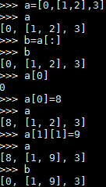
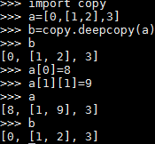

# Python 学习

1. Python在定义类的时候，继承父类object是新式类，Python3中默认所有类都继承object，这么写便于Python2和3统一  

2. Python可以引入ConfigParser来进行配置文件的读取与写入  

3. Python通过uuid模块来生成唯一ID，分为五个算法，使用时通过例如uuid.uuid1()生成

4. 三个函数式编程的内置函数  

| name | function |
| ---- | ---- |
| filter | 把一个函数应用于序列的每一项，保留该函数返回真值时的所有元素 |
| map | 对序列中的每一个元素执行函数 |
| reduce | 对序列前两个元素执行函数，生成的结果 |

5. for循环整个作为参数时，可以整个传入  
如：打印10以内的偶数  
`print [x for x in range(10) if x%2==0]`

6. Python的__name__是当前模块名  
当模块被直接运行时，模块名为原先的模块名  
`if __name__ == '__main__'`的意思就是，当直接运行该模块时，执行后面的代码

7. 装饰器  
装饰器本质是一个Python的函数或类，可以让其他函数或类在不需要做任何代码修改的前提下增加额外功能，常用于有切面需求的场景，比如：插入日志、性能测试、事务处理、缓存、权限校验等  
[理解Python装饰器]:<https://foofish.net/python-decorator.html>

8. 偏函数  
functools模块提供了偏函数功能，简单说，functools.partial作用就是把一个函数的某些参数固定住，返回一个新的函数，这样再调用这个新的函数时，就会更方便地实现一些定制功能  

9. 内置函数enumerate可以遍历并自动计数  
```
for counter, value in enumerate(some_list):
    print(counter, value)
```  
enumerate还可以接收参数，比如`enumerate(list, 1)`表示从第一个开始计数  

10. python字典的keys(), values(), items()都会返回一个list，其中items()返回的是键值对的list  

11. python的\*args和\*\*kwargs是约定生成的，只有前面的\*和\*\*是必须的  
\*args和\*\*kwargs用于函数定义，将不定数量的参数传递给一个函数  
\*args用来发送一个非键值对的可变数量的参数列表给一个函数, \*\*kwargs允许将不定长度的键值对，作为参数传给函数

12. python可以将函数赋值给一个变量，此时如果用del删除该函数，变量仍可以使用该函数的功能  
当函数名后面带()时，该函数会被执行；如果只有函数名，则可以被到处传递  

13. Python的赋值与深复制、浅复制  
> + 赋值  
Python中的赋值操作总是建立对象的引用值，而不是复制对象；Python中的变量更像是指针，而不是数据存储区域  
比如`x=1; y=x`，此时修改x的值，y的值也会跟着改变
> + 深复制与浅复制  
浅复制：  
  
深复制：  
  
浅复制只是复制一个引用，而深复制会连同引用和指向的元素一同复制  
copy标准库模块能够生成完整拷贝；deepcopy的本质是递归copy  

14. 可以通过解压序列（tuple、list、str等）的方法来赋值给多个变量  
```
>>> p = (4, 5)  
>>> x, y = p  
>>> x  
4  
>>> y  
5  
>>> s = 'Hello'  
>>> a, b, c, d, e = s
>>> a  
'H'
```
注意**数量必须相等**  
python3之后，当想将序列中多个元素都赋值给一个变量时，可以使用\*号表达式  
```
>>> *trailing, current = [10,8,7,1,9,5,10,3]
>>> trailing
[10,8,7,1,9,5,10]
>>> current
3
```

15. **生成器**  
生成器也是一种迭代器，所谓迭代器就是定义了next方法的对象  
生成器只能对它迭代一次，这是因为他们的值并没有存在内存中，而是在运行时生成值  
生成器最佳应用场景是：你不想同一时间将所有计算出来的大量结果集分配到内存当中，特别是结果集里还包含循环，使用生成器可以减少资源消耗  
许多Python 2里的标准库函数都会返回列表，而Python 3都修改成了返回生成器，因为生成器占用更少的资源  

16. 字典的get方法  
返回指定key的value，如果value不在字典中，则返回默认值  
`dict.get(key, default=None)`，default可以自己指定  

17. **堆**  
heapq模块为堆模块  
`heapq.nlargest(n, iterable, key=None)`和`heapq.nsmallest(n, iterable, key=None)`返回一个集合的最大或最小的N个元素列表  
比如：  
```
import heapq
nums = [1, 8, 2, 23, 7, -4, 18, 23, 42, 37, 2]
print(heapq.nlargest(3, nums)) # prints [42, 37, 23]
print(heapq.nsmallest(3, nums)) # prints [-4, 1, 2]
```  
还可以接受关键字参数  
比如：  
```
portfolio = [
    {'name': 'IBM', 'shares': 100, 'price': 91.1},
    {'name': 'AAPL', 'shares': 50, 'price': 543.22},
    {'name': 'FB', 'shares': 200, 'price': 21.09},
    {'name': 'HPQ', 'shares': 35, 'price': 31.75},
    {'name': 'YHOO', 'shares': 45, 'price': 16.35},
    {'name': 'ACME', 'shares': 75, 'price': 115.65}
]
cheap = heapq.nsmallest(3, portfolio, key=lambda s: s['price'])
expensive = heapq.nlargest(3, portfolio, key=lambda s: s['price'])
```
本质都是堆排序  

18. 可以使用dir()来获取一个对象的所有属性和方法  

19. Python并没有提供抽象类和抽象方法，但是提供了内置模块abc来模拟抽象类  

20. 删除字典的一个key可以用del  

21. **__call__方法**  
。。。。。。。。

22. **包的概念**  
包定义了一个由模块、子包、子包下的子包等组成的Python应用环境  
在包的目录下，必须有一个__init__.py的文件，用来标识它是一个包  

23. **with语句**  
。。。。。

24. list的初始化  
初始化一个固定大小的list  
比如：初始化一个有5个元素，每个元素都为1的list可以通过`list = [1] * 5`  
