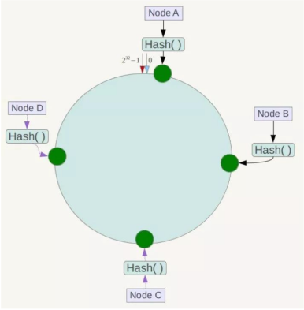

# 分布式哈希算法
## 普通Hash方式
对于分布式集群来说，当需要查询一个文件时，如果顺序遍历所有的节点，则时间复杂度太高  
此时可以使用hash，存储文件时使用类似于数据库的分库分表规则，按hash值来存储，将每一个文件分配到特定的服务器  
假设查找的文件为a，有4台服务器，哈希函数为：hash(x)，则普通哈希公式为hash(a)%4，直接定位到一个服务器，可以不用遍历所有的服务器，大大提高性能  
但已有的hash也有问题，当服务器节点数量发生变化时，所有的数据都需要跟着发生变化，因为公式中的模发生了变化  
所以普通hash在扩容的时候代价很大，会影响所有元素的移动  
如果要添加一台机器，已经存储到机器上的文件可能都需要重新分配

## 一致性Hash  
于是产生了改进的一致性hash算法  
一致性hash也是取模，但不是对服务器数量取模，而是对2^32来取模（hash值为32位无符号整数）  
一致性hash将整个hash空间组织成一个虚拟的圆环，从0——2^32-1  
下一步对各个服务器进行一个hash，比如可以用服务器的IP或主机名作关键字（一般用IP、ID等唯一性的），各服务器分布在hash环上，如图：  

